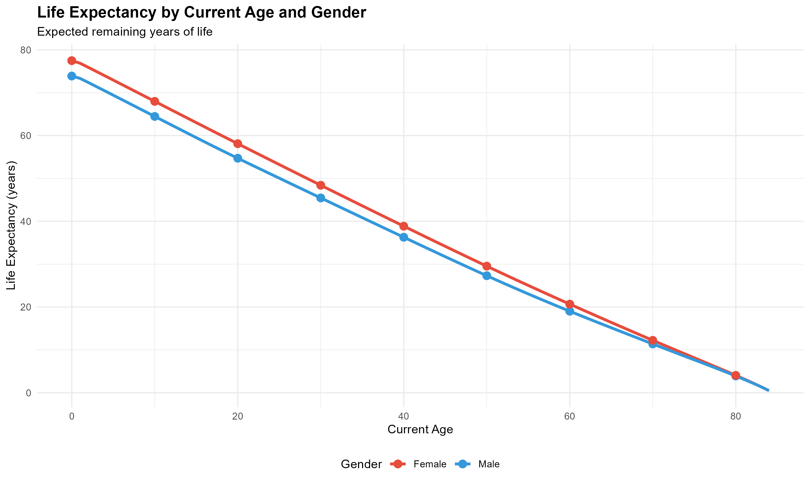
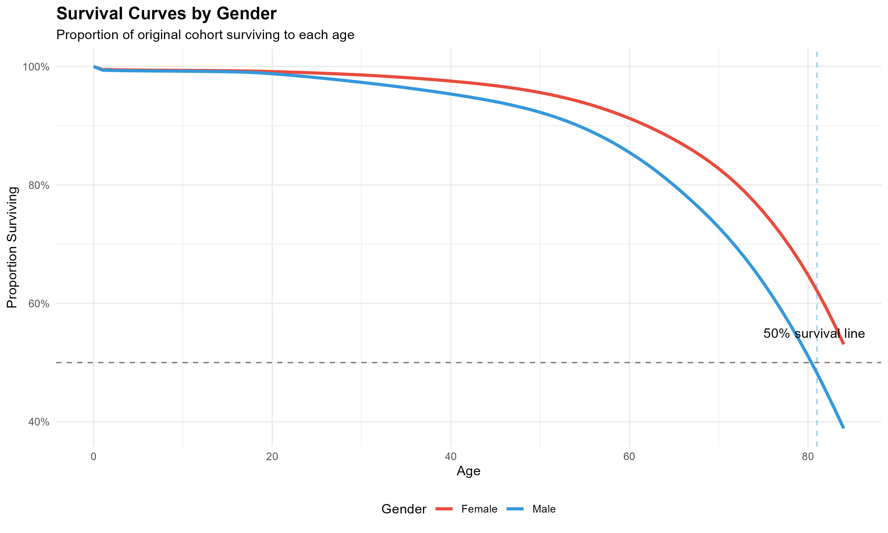
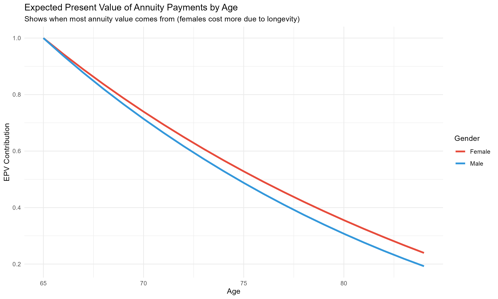
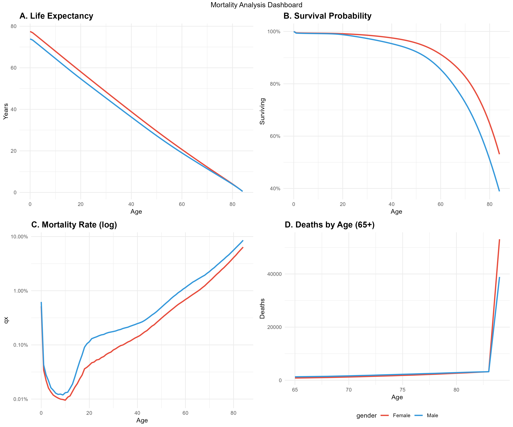

# Mortality Analysis & Life Table Construction

**Author:** Lavanya Khurana  
**Date:** December 2025  
**Purpose:** Life & Health Actuarial Analysis Project  

---

## TL;DR

- Built complete actuarial life tables from U.S. mortality data (2015–2019)
- Calculated life expectancy, survival probabilities, and actuarial present values
- Applied results to life insurance pricing, annuities, and pension valuation
- Implemented in **R**, aligned with **SOA Exam FAM** and **IFoA CM1 / CS2**
- Key result: females live ~3.6 years longer → **32% lower life insurance cost, 6% higher annuity cost**

---

## Overview

Implemented standard actuarial life table methodology using CDC population mortality data to analyze survival patterns and quantify longevity risk. The analysis mirrors professional actuarial workflows used in **life insurance pricing, annuity valuation, and pension funding**.

---

## Key Findings

### Life Expectancy at Birth
Males: 73.9 years
Females: 77.5 years
Gender gap: 3.6 years (4.9% difference)

### Expected Retirement Duration (from Age 65)
Males: 15.2 additional years (live to 80.2)
Females: 16.4 additional years (live to 81.4)
Weighted average: 15.8 years

### Actuarial Present Values (5% Interest Rate)

**Whole Life Insurance:**
Male: $0.0387 per $1 benefit
Female: $0.0263 per $1 benefit
31.8% lower cost for females

**Life Annuity (starting at age 65):**
Male: $10.80 per $1/year payment
Female: $11.48 per $1/year payment
6.3% higher cost for females

### Business Impact
Females have ~32% lower fair life insurance premiums due to superior mortality
Females require ~6% higher annuity reserves due to longevity risk
For a $60,000/year pension: males need $648K vs females $689K at retirement

---

## Methodology

Constructed **period life tables** for a hypothetical cohort of **100,000 lives** using standard actuarial assumptions.

**Core calculations:**
- Mortality rates (qₓ)
- Survival function (lₓ)
- Person-years lived (Lₓ)
- Life expectancy (eₓ)
- Actuarial present values:
  - Whole life insurance (Aₓ)
  - Life annuities (äₓ)

Mid-year death assumption and constant 5% interest rate applied.

---

## Actuarial Applications

### Life Insurance
- Fair premium differences driven by mortality experience  
- Demonstrates impact of assumptions on pricing outcomes  

### Annuities & Pensions
- Quantifies longevity risk at retirement age  
- Explains higher reserve requirements for females  
- Relevant to defined benefit pension valuation  

### Regulatory Context
- **EU:** 2012 Gender Directive banned gender-based pricing (Test-Achats case)
- **U.S.:** Gender-based pricing remains permitted based on actuarial justification 

---

## Data Source

- **CDC WONDER Database** (National Center for Health Statistics)  
- Period: 2015–2019 (5-year average)  
- Ages: 0–84 (85+ aggregated in public data)  
- Population: U.S. males and females

- ## Key Visualizations

**Survival Curves**  

**Annuity EPV Distribution**  

**Integrated Mortality Dashboard**  

---

## Technical Details

- **Language:** R  
- **Libraries:** tidyverse, ggplot2, scales, viridis, gridExtra  
- **Assumptions:**
  - Period life table  
  - 5% interest rate  
  - Uniform distribution of deaths  
  - No mortality improvement  

---

## What I Learned

- Translating raw mortality data into actuarial life tables  
- Quantifying longevity risk for insurance and pensions  
- Sensitivity of reserves to mortality and interest assumptions  
- Importance of actuarial judgment in modeling  

---

## Limitations & Extensions

**Limitations**
- Age truncation: CDC data aggregates ages 85+ without single-year detail
- No mortality improvement: Uses current rates without projecting future longevity trends
- Simplified assumptions: Uniform distribution of deaths, deterministic interest rate
- Aggregate data: No segmentation by smoking status, occupation, health, or socioeconomic factors

**Extensions**
- Mortality improvement modeling (Lee–Carter)  
- COVID-19 impact analysis  
- Cause-of-death and socioeconomic segmentation  
- Stochastic present value modeling  

---

## Exam & Career Relevance

- **SOA:** Exam P, FM, FAM, ALTAM/LTAM  
- **IFoA:** CS2, CM1  

Demonstrates life contingencies and survival analysis used in professional actuarial work.

---

## Contact

**Lavanya Khurana**  
📧 khurana.lavanya7@gmail.com
